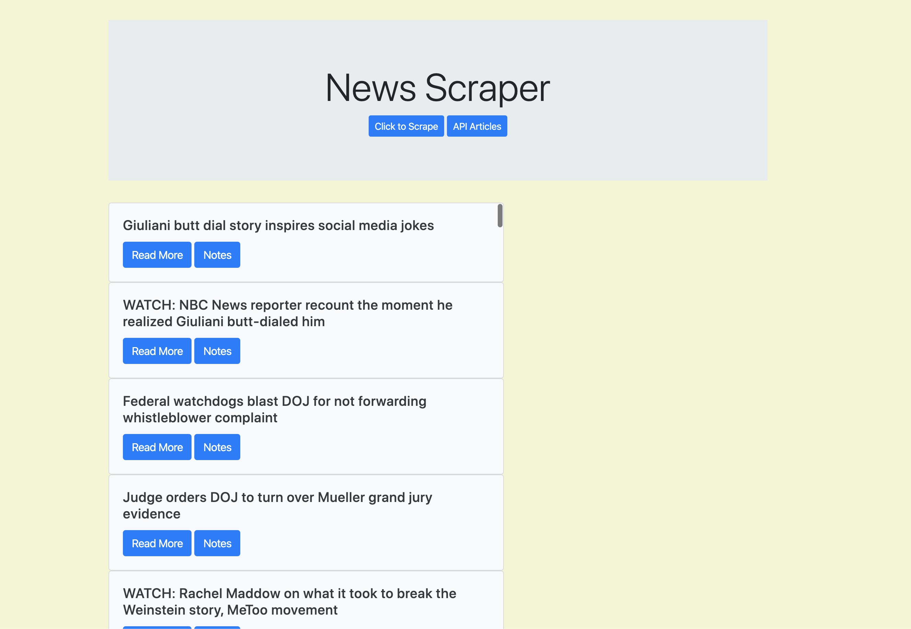

# All-the-News-That-s-Fit-to-Scrape

An application built with Node, Express Servers, Handlebars, MongoDB and Cheerio.

## App Screen-Shots:


# Link to full app demo on Heroku:
https://my-scraper-hw.herokuapp.com/

## About the project:
We had to create a web-scraping application using MongoDB and Handlebars as the templating engine. The full list of technologies is referenced below.

## User Guide:
1. The main landing page displays the recent content scraped. 
2. Click ther scrape button for an updated list. 
3. Click notes to add a note and save the comment.

## MVP Objectives:

1. Whenever a user visits the site, the app should scrape stories from a news outlet of your choice and display them for the user. Each scraped article should be saved to the application database. At a minimum, the app should scrape and display the following information for each article:

``* Headline - the title of the article
  * Summary - a short summary of the article
  * URL - the url to the original article

2. Users should also be able to leave comments on the articles displayed and revisit them later. The comments should be saved to the database as well and associated with their articles. Users should also be able to delete comments left on articles. All stored comments should be visible to every user.

## Stretch Goals:

  
## Techology Stack:
  * HTML
  * CSS
  * BootStrap
  * JavaScript
  * Node.js
  * npm express
  * npm morgan
  * npm body-parser
  * npm axios
  * npm cheerio
  * MongoDB
  * Mongoose
  * Handlebars
  * Heroku


## Methodology:

Used the web scraping class activities as a guideline, particularly #20 (scraping into Mongoose)

## Problems Overcome:

Getting the scraped content to load onto the DOM. Code snippet shown below.

## Problems Still Facing:

Accessing the links for each article.
Getting the note feature to work.

## Code Snippets:
```
app.get("/", function(req, res) {
  db.Article.find({}).then(function(data) {
      var dbData = {
        articles: data
      };
      res.render("index", dbData);
    })
    .catch(function(err) {
      console.log(err);
      res.send(err);
    });
});
```

## File Structure Screen-Shot:


## Link to Github Portfolio Page


## You can also reach me on LinkedIn.

https://www.linkedin.com/in/oliver-sun-4b6baba/

